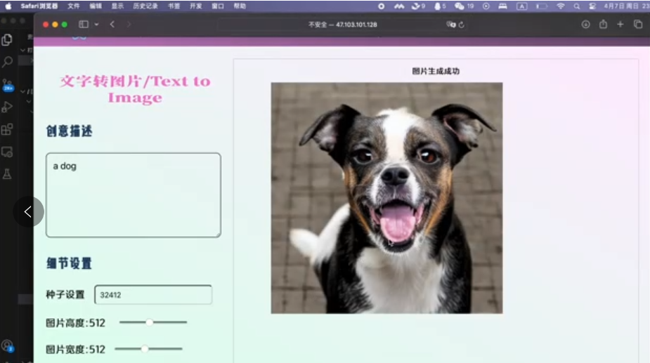
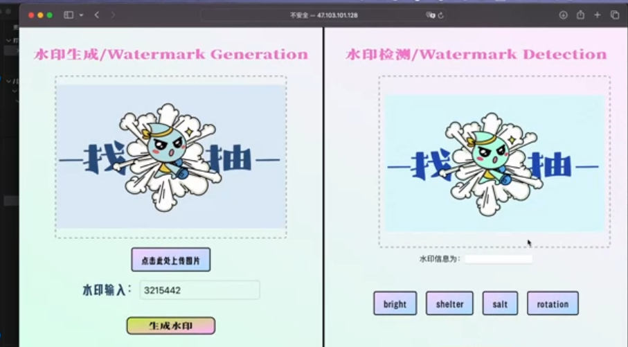
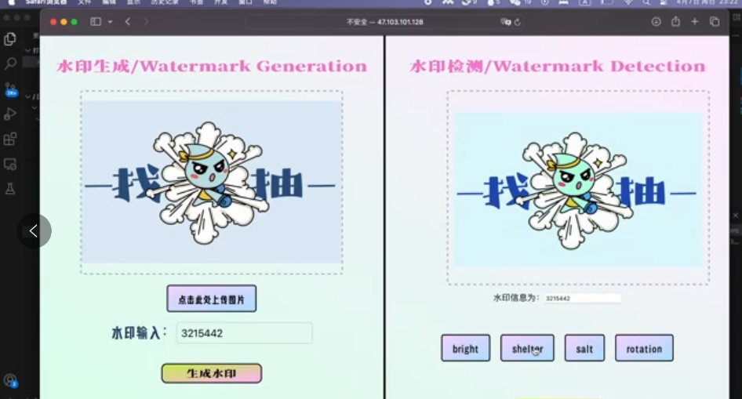
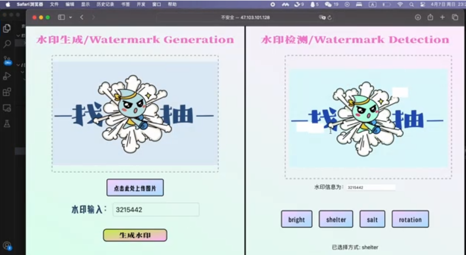
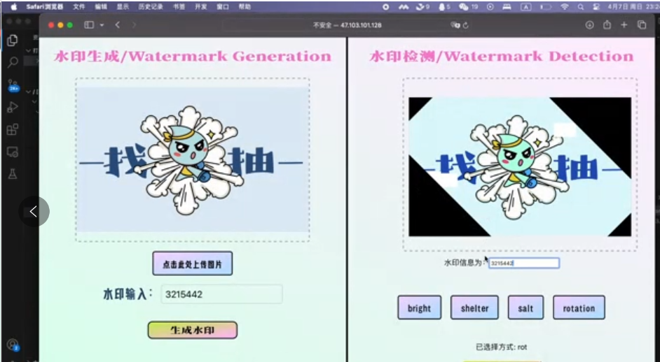

# 文生图及其衍生图像处理工具

## 介绍

在数字内容的生成和保护领域，文生图模型和图片水印技术具有重要意义。本项目前端基于 react撰写用户界面及相应的应用板块，后端基于coco数据集预训练的AI模型 Diffusion 进行文生图推理，使用Qwen-VL-Chat 进行实体检测任务；基于 DCT 、 DWT 、四维分块等实现嵌入水印，基于 K-Means 算法实现提取水印。

## 部署

```bash
git clone https://github.com/xiaji2021/NIS3366.git
cd NIS3366

# 将水印生成模块添加到环境变量
cd blind_watermark
pip install .

# 安装diffusers
pip install --upgrade diffusers[torch]

# 安装GroundingDINO所需库
cd ../GroundingDINO
pip install -e .

# 安装Qwen-VL所需库
cd ../Qwen-VL
pip install -r requirements.txt

# 安装react所需依赖
npm install axios
npm install react-router-dom
npm install -g serve
```

由于模型参数过大，用户需要在huggingface自行下载runwayml/stable-diffusion-v1-5(https://huggingface.co/runwayml/stable-diffusion-v1-5 )，Qwen-VL-Chat(https://huggingface.co/Qwen/Qwen-VL-Chat)，groundingdino_swint_ogc.pth(https://huggingface.co/ShilongLiu/GroundingDINO/resolve/main/groundingdino_swinb_cogcoor.pth)至model文件夹中。

## 如何使用

进入NIS3366主目录，运行：

```bash
npm run build
serve -s build -l <port>
```

进入src目录，运行：

```bash
python3 backend.py
```


## 效果

#### 1.功能界面实现测试

##### 文生图界面

- 

##### 实体抽取界面

- 

##### 水印检测与生成界面

- 

#### 2. 功能实现测试

##### 文生图功能测试

- 

##### 水印生成与检测模块

- **水印生成**
    - 
- **水印检测**
    - 

- **遮蔽攻击检测**
    - 

- **旋转攻击检测**
    - 

##### 实体检测功能测试

- 

## 如何训练

```shell
python mycode/generate_images_by_diffusers_train.py
python mycode/generate_images_by_groundingdino_train.py
sh mycode/finetune_lora_single_gpu.sh
```

注：Qwen-VL的训练需要的显存及训练速度如下，也可使用Qwen-VL-Chat的基础版本。

| Method      | Sequence Length | Sequence Length | Sequence Length | Sequence Length |
| ----------- | --------------- | --------------- | --------------- | --------------- |
| Method      | 384             | 512             | 1024            | 2048            |
| LoRA (Base) | 37.1G / 2.3s/it | 37.3G / 2.4s/it | 38.7G / 3.6s/it | 38.7G / 6.1s/it |
| LoRA (Chat) | 23.3G / 2.2s/it | 23.6G / 2.3s/it | 25.1G / 3.5s/it | 27.3G / 5.9s/it |
| Q-LoRA      | 17.0G / 4.2s/it | 17.2G / 4.5s/it | 18.2G / 5.5s/it | 19.3G / 7.9s/it |